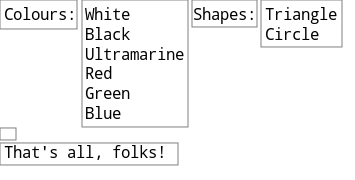
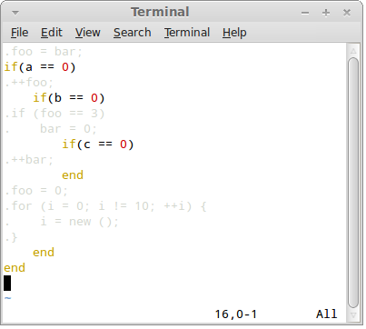
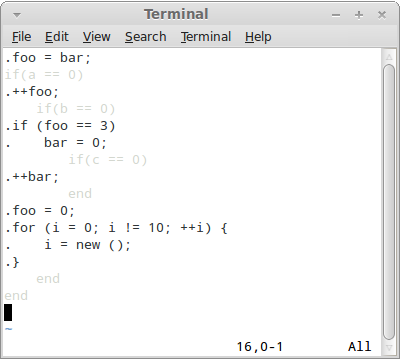
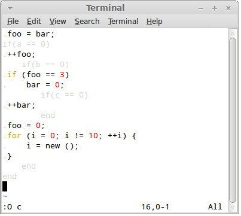

RIBOSOME
=======

A simple generic code generation tool.

## In 50 words

1. You write standard Ruby scripts.
2. However, lines starting with a dot (.) go straight to the output file.
3. To expand Ruby expressions within dot-style lines use @{expr} construct.

## Example

```
.#include <stdio.h>
.
.int main() {
for i in 1..10
.    printf("@{11-i}!\n");
end
.    printf("Go!\n");
.    return 0;
.}
```

The script above produces the following output:

```
#include <stdio.h>

int main() {
    printf("10!\n");
    printf("9!\n");
    printf("8!\n");
    printf("7!\n");
    printf("6!\n");
    printf("5!\n");
    printf("4!\n");
    printf("3!\n");
    printf("2!\n");
    printf("1!\n");
    printf("Go!\n");
    return 0;
}
```

## How it differs

Any non-trivial code generating code is hard to read, understand and maintain.
While most code generating tools do the technical part of the job all right,
they fail on the manageability aspect. Ribosome tries to address it using
following measures:

- Generated code is properly indented (also think of generating Python code!)
- No escape sequences or other visual smog in the source.
- Flexibility in indentation of the source.
- Colouring support in editors.

Note that ribosome trades speed for readability/maintainability and thus isn't
well suited for performance-critical tasks such as, for example, generaing HTML
on the fly.

## Installation

Ribosome is a single Ruby script, thus all you need is to install Ruby
beforehand and copy 'ribosome' script onto your path.

However, on UNIX systems you can use more standard way of installing the
software:

```
$ ./autogen.sh
$ ./configure
$ make check
$ sudo make install
```

## Command line

The generator is called 'ribosome'. It takes one argument. The script file,
also known as DNA file. All the remaining arguments are passed unmodified
to the script.

```
$ ribosome foo.dna
```

## Documentation

At this point you are ready to use ribosome to do your own code generation.
However, you may benefit from reading about the finer points of the tool
in the following sections.

### Control language

DNA file is a standard Ruby program (except for the lines starting with
a dot). Therefore it is possible to just take your existing Ruby program
and run it with ribosome:

```
ribosome foo.rb
```

### Simple output

Lines starting with a dot (.) are copied directly to the output:

```
for i in 1..2
.Test!
end
```

The above script produces the following output:

```
Test!
Test!
```

Lines starting with a dot can be terminated by $ sign. The sign is optional,
however, if there's whitespace at the end of the line it is recommended to
finish the line with $ to prevent invisible whitespace getting into the output
files.

```
.Hello!    $
```

### Redirecting output

By default, the output is directed to stdout. Therefore, it can be re-directed
using classic UNIX pipes:

```
ribosome test.dna > test.txt
```

You can also redirect the output to a specific destination directly from
the DNA file. Use '/!output' command to accomplish the task:

```
.    /!output("test.txt")
.    Test!
```

Note that ribosome commands may appear only in lines starting with a dot,
may be preceded with arbitrary amout of whitespace (which will be ignored) and
start with slash and exclamation mark. Commands behave like standard
Ruby functions and use the same syntax:

```
name = "foo"
./!output name + ".txt"
```

To redirect the output back to the console use '/!stdout' command:

```
./!output("test.txt")
.This line goes to the file!
./!stdout()
.This line goes to the console!
```

Finally, you can append new text to existing file using '/!append' command:

```
./!output("test.txt")
.Stuff
./!stdout()
./!append("test.txt")
.More stuff
```

### Embedded expressions

Often, you need to insert a computed value into the output. You can do so by
embedding Ruby expressions into dot-style lines:

```
name = 'Fred'
.Hello, @{name}!
```
With straight Ruby functions, the return value is converted into a string
and written to the output.

If the embedded expression produces ribosome output itself, the text is
inserted into the output file instead of the return value:

```
def greet(name)
.printf ("Hello, @{name}!\n");
end

.int main () {
.    @{greet("Alice")}
.    @{greet("Bob")}
.    return 0;
.}
```

### Line concatenation

Typically, each dot-style line is translated into a separate line in the
output file. Sometimes, however, you may want to generate complex stuff into
a single line of the output file. In such case new line can appended directly
to the previous line. Use /+ operator to achieve the behaviour:

```
.Hello $
for i in ["Alice", "Bob", "Carol"]
.   /+@{i} $
end
./+!
```

Note that all the whitespace preceding /+ operator is silently ignored:

```
Hello Alice Bob Carol !
```

### Separators

A common task with code generation is to insert separators between the items
of a list. Ribosome provides '/!separate' command to help with the task.
The command must precede a Ruby loop (for, while, each or similar) and takes
a single parameter, the text to use as a separator:

```
.Hello $
./!separate(", ")
for i in ["Alice", "Bob", "Carol"]
.   /+@{i}
end
./+!
```

Note that the separator doesn't appear after the last element of the list:

```
Hello Alice, Bob, Carol!
```

### Strict embedded expressions

You may have noticed that any whitespace generated by the embedded expressions
is trimmed. To keep the whitespace intact, use &{} operator instead of @{}:

```
s = " 2 "
.1@{s}3
.1&{s}3
```

The script above produces following output:

```
123
1 2 3
```

### Nested embedded expressions

Producing output that is a DNA file itself can be tricky. The main problem is
that a lot of escape sequences would have to be used. To solve that, ribosome
provides a tool called nested embedded expressions.

Nested embedded expressions are written @N{} or &N{}, where N is a digit from
1 to 9. The number is called the 'level' of the nested expression. During the
compilation nested expressions of first level are replaced by ordinary embedded
expressions. Nested expressions of second level are replaced by nested
expressions of first level, nested expressions of third level are replaced by
nested expressions of second level et c.

```
@9{x} => @8{c} => @7{x} => ... => @2{x} => @1{x} => @{x}
```

Consider, for exmaple, this script:

```
.name = "Alice"
..Hello, @1{name}!
```

It compiles into this script:

```
name = "Alice"
.Hello, @{name}!
```

Which, in turn, is compiled into:

```
Hello, Alice!
```

### Escape functions

In the rare cases when you need to generate a sequence of characters that
accidentally matches a ribosome operator, you can use one of the predefined
escape functions. For example:

```
.123@{at}{456
```

Translates into:

```
123@{456
```

Full list of escape functions:

    at() => @
    amp() => &
    slash() => /

### Advanced layout management

Consider the following script:

```
def colours()
.    White
.    Black
.    Ultramarine
.    Red
.    Green
.    Blue
end

def shapes()
.    Triangle
.    Circle
end

.Colours: @{colours} Shapes: @{shapes}
.
.That's all, folks!
```

It produces the following output:

```
Colours: White       Shapes: Triangle
         Black               Circle
         Ultramarine
         Red
         Green
         Blue

That's all, folks!
```

To undestand how ribosome layouts the code, it is necessary to keep in mind
that it's not characters that are placed on a line, but rather rectangular
blocks of text.

Every literal string is considered to be a block of text (consisting of a single
line) and so is every embedded expression. However, given that embedded
expressions can generate multiple lines they are treated as multi-line
blocks of text.

The blocks are aligned to the top of the line:

Thus, the line:

```
.Colours: @{colours} Shapes: @{shapes}
```

Is laid out like this:


Every next line is laid out directly bellow the longest block on the previous
line:



Note that @-style embedded expressions trim the whitespace from the left, right,
top and bottom of the block. Therefore, the block produced by '@{colours}'
expression looks like this:


Also note that whitespace is trimmed from the block as a whole, not from each
individual line. That way, the block alway remains rectangular in shape:


This feature is extremely important to produce properly aligned code.
Consider this example:

```
def greet(name)
.    printf ("Hello, @{name}!\n");
end

.@{greet("Alice")}
.if (is_bob_present) {
.    @{greet("Bob")}
.}
```

The script above produces following output:

```
printf ("Hello, Alice!\n");
if (is_bob_present) {
    printf ("Hello, Bob!\n");
}
```

Note how the greeting is properly aligned in both cases. What happens under
the hood is that the whitespace from line 2 of the script is trimmed by @{}
operator, while the whitespace on line 7 is treated as a text literal (i.e.
as one-line text block) and is appended to the line before the greeting to Bob.

### Aligning text

Sometimes the layout management described above proves insufficient because
the amount of indentation needed at particular place is not known at the time
of writing the DNA script. In such cases, '/!align' command may prove useful.

'/!align' command creates a new line containing a copy of any leading whitespace
from the previous line. It is typically followed by '/+' operator to append the
following text directly to the whitespace:

```
.&{" " * random(40)}Hello,
./!align
./+world!
```

The example generates following output:

```
             Hello,
             world!
```

### Generating tabs

Ribosome doesn't allow for tabs in the input, however, when generating
output it can, on demand, replace as much of the leading whitespace as possible
by tabs. To switch this functionality on use '/!tabsize' command, providing
desired size of the tab as a parameter:

```
./!tabsize(4)
.for (i = 0; i != 10; ++i)
.    printf("Hi!\n");
.}
```

In the output, leading four spaces in the line 3 will be replaced by a tab.

Set tabsize to zero to switch the generation of tabs off.

### Importing DNA files

In case of need you can import a DNA file using '/!include' command.
The behaviour is the same as if the contents of the imported file was
copied to the location in question in the importing file:

```
./!include("foo.dna")
```

## Distributing the code generator

Ribosome is a compiler-compiler. It first compiles DNA file into a straight
Ruby program (called RNA script) which is then executed to produce the generated
code. The intermediate step is fully hidden from the user.

The above works well for ad-hoc and throw-away code generation, however, if you
want to distribute the code generator to the users it is better to generate
the RNA script first and distribute that instead of the DNA script -- that way
there's no dependency on ribosome itself (the user will do with only Ruby
installed):

```
ribosome --rna foo.dna > foo.rb
```

Also note that if your DNA script is composed of multiple DNA files (using
/!include command) only a single RNA script is generated, making the
distribution to the users easier.

## Syntax highlighting

Given that DNA files contain two overlapping indentations, syntax highlighting
is crucial for good code readability.

### Vim

To install ribosome syntax highlighting for vim, copy the ribosome.vim file
from the root directory to vim's syntax directory. For example:

```
sudo cp ribosome.vim /usr/share/vim/vim73/syntax
```

Afterwards, open vim's filetype file:

```
sudo vim /usr/share/vim/vim73/filetype.vim
```

And add the following line to it:

```
au BufNewFile,BufRead *.dna setf ribosome
```

Now you are ready to open a DNA file in vim:


What you see is so called "common view" where control language (Ruby) and
generated language (C) are highlighted in such a way as to allow inspection
of both.

When in other views, you can switch to common view using F2 key.

Press F3 key to switch to the "Ruby view":



Here the control language has its native syntax colouring, while generated
code is shaded as not to distract from inspecting the control language.

Press F4 key to switch to the "Output view":



In this view the control language is shaded and output language is fully
visible.

However, vim does not know what syntax highlighting to use for the generated
language. You can instruct it to use particular syntax highlighting algorithm
using O (capital letter O) command. Pass the name of the language as an
argument:



### Other editors

In the future, we intend to provide highlighting rules for the most common
editors. Any help in this area will be highly appreciated!

## License

Ribosome is licensed under MIT/X11 license.

