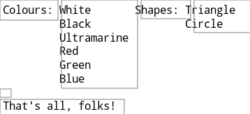

RIBOSOME
=======

A simple generic code generation tool.

## In 50 words

1. You write standard Ruby scripts.
2. However, lines starting with a dot (.) go straight to the output file.
3. To expand Ruby expressions within dot-style lines use @{expr} construct.
4. Support for reading input data from JSON or XML file is provided.

## Example

```
.#include <stdio.h>
.
.int main() {
for i in 1..10
.    printf("@{11-i}!\n");
end
.    printf("Go!\n");
.    return 0;
.}
```

The script above produces the following output:

```
#include <stdio.h>

int main() {
    printf("10!\n");
    printf("9!\n");
    printf("8!\n");
    printf("7!\n");
    printf("6!\n");
    printf("5!\n");
    printf("4!\n");
    printf("3!\n");
    printf("2!\n");
    printf("1!\n");
    printf("Go!\n");
    return 0;
}
```

## Installation

Ribosome is a single Ruby script, thus all you need is to install Ruby
beforehand.

However, if you are going to use JSON input, you'll additionally have to
instal 'json' gem.

## Command line

The generator is called 'ribosome'. It takes two arguments. The script file,
also known as DNA file, and the data file in JSON/XML format:

```
$ ribosome foo.dna bar.json
```

If not needed, the data file may be ommitted.

## Documentation

DNA file is a standard Ruby program (except for the lines starting with
a dot). Therefore it is possible to just take your existing Ruby program
and run it with ribosome:

```
ribosome foo.rb
```

### Simple output

Lines starting with a dot (.) are copied directly to the output:

```
for i in 1..2
.Test!
end
```

The above script produces the following output:

```
Test!
Test!
```

Lines starting with a dot can be terminated by $ sign. The sign is optional,
unless there's a whitespace at the end of the line. In such case the $ sign
is mandatory to avoid invisible whitespace getting into the output files.

```
.Hello!    $
```

### Redirecting output

By default, the output is directed to stdout. Therefore, it can be re-directed
using classic UNIX pipes:

```
ribosome test.dna > test.txt
```

However, you can redirect the output to a specific destination directly from
the DNA file. Use 'output' function to accomplish the task:

```
output("test.txt")
.Test!
```

To redirect the output back to the console use 'stdout' function:

```
output("test.txt")
.This line goes to the file!
stdout()
.This line goes to the console!
```

### Embedded expressions

Often, you need to insert a computed value into the output. You can do so by
embedding Ruby expressions into dot-style lines:

```
name = 'Fred'
.Hello, @{name}!
```
With straight Ruby functions, the return value is converted into a string
and written to the output.

If the enbedded expression produces ribosome output itself, the text is
inserted into the output file instead of the return value:

```
def greet(name)
.printf ("Hello, @{name}!\n");
end

.int main () {
.    @{greet("Alice")}
.    @{greet("Bob")}
.    return 0;
.}
```

### Input files

Code generators typically need rich structured input instead of simple
command line parameters.

Ribosome supports both JSON and XML input files. It uses file extension to
distinguish beween the two. Thus, JSON input files should have .json
extension and XML imput files should have .xml extension.

Consider a JSON file that contains names of different errors:

```
 ["EINVAL", "EMFILE", "EINTR"]
```

Following DNA script will convert it into a C header file:

```
errno = 1
for i in root
.#define @{i} @{errno}
    errno += 1
end
```

Note that the root node of the JSON input is available as JSON object
(JSON class defined by 'json' gem) called 'root'.

In the case where you need to supply whole blocks of code via the input file,
XML fares better than JSON:

```
<root>
    <function name="foo">
        printf ("foo");
        printf ("\n");
    </end>
    <function name="bar">
        printf ("bar");
        printf ("\n");
    </end>
</root>
```

The script can access the root node of the XML input as REXML::Element object
called 'root':

```
root.elements.each("function") do |m|
.void @{m.attributes["name"]}() {
.    @{m.texts.join}
.}
.
end
```

### Line concatenation

Typically, each dot-style line is translated into a separate line in the
output file. Sometimes, however, you may want to generate complex stuff into
a single line of the output file. In such case new line can appended directly
to the previous line. Use /+ operator to achieve the behaviour:

```
.Hello $
for i in ["Alice", "Bob", "Carol"]
.   /+@{i} $
end
./+!
```

Note that all the whitespace preceding /+ operator is silently ignored:

```
Hello Alice Bob Carol!
```

### Separators

A common task with code generation is to insert separators between the items
of a list. Ribosome provides /! operator to help with the task. The line
containing the operator must precede Ruby loop (for, while, each or similar).
Any whitespace preceding the operator is silently ignored. Any text following
the operator is used as a separator:

```
.Hello $
./!, $
for i in ["Alice", "Bob", "Carol"]
.   /+@{i}
end
./+!
```

Note that the separator doesn't appear after the last element of the list:

```
Hello Alice, Bob, Carol!
```

### Strict embedded expressions

You may have noticed that any whitespace generated by the embedded expressions
is trimmed. To keep the whitespace intact, use &{} operator instead of @{}:

```
s = " 2 "
.1@{s}3
.a&{s}3
```

The script above produces following output:

```
123
1 2 3
```

### Nested embedded expressions

Producing output that is a DNA file itself can be tricky. The main problem is
that a lot of escape sequences would have to be used. To solve that, ribosome
provides a tool called nested embedded expressions.

Embedded expressions that have been introduced so far are embedded expressions
of first level. They can be written as @{} and &{}. Alternatively, @1{} and &1{}
can be used. The expression is evaluated during the compilation and the result
is written to the output.

Embedded expressions of second level are written @2{} and &2{}. They are
replaced by embedded expressions of first level during the compilation.
Similarly, embedded expressions of the third level are replaced by embedded
expressions of the second level. Et c.

Consider, for exmaple, this script:

```
output("greet.dna")
.name = "Alice"
..Hello, @2{name}!
```

It compiles into this script:

```
name = "Alice"
.Hello, @1{name}!
```

Which, in turn, is compiled into:

```
Hello, Alice!
```

### Escape functions

In the rare cases when you need to generate a sequence of characters that
accidentally matches a ribosome operator, you can use one of the predefined
escape functions. For example:

```
.123@{at}{456
```

Translates into:

```
123@{456
```

Full list of escape functions:

    at() => @
    amp() => &
    slash() => /

### Advanced layout management

To undestand how ribosome layouts the code, it is necessary to understand
that it works with rectangular blocks of text rather than with lines.

Consider the following script:

```
def colours()
.    White
.    Black
.    Ultramarine
.    Red
.    Green
.    Blue
end

def shapes()
.    Triangle
.    Circle
end

.Colours: @{colours} Shapes: @{shapes}
.
.That's all, folks!
```

It produces the following output:

```
Colours: White       Shapes: Triangle
         Black               Circle
         Ultramarine
         Red
         Green
         Blue

That's all, folks!
```

And here are the boundaries of the individual rectangles that ribosome
manipulates:



### Generating tabs

Ribosome doesn't allow for tabs in the input, however, when generating
output it can, on demand, replace all leading whitespace by tabs. To switch
this functionality on use 'tabsize' function:

```
tabsize(4)
.for (i = 0; i != 10; ++i)
.    printf("Hi!\n");
.}
```

In the output, leading whitespace in line 3 will be replaced by a tab.

Set tabsize to zero to switch the generation of tabs off.

##Syntax highlighting

Given that DNA files contain two overlapping indentations, it is crucial for
good readability to highlight the dot-style ribosome lines in a different
colour than surrounding Ruby code.

Following highlighters are supported at the moment:

    ribosome.vim

In the future, we intend to provide highlighting rules for the most common
editors. Any help in this area will be highly appreciated!


##License

Ribosome is licensed under MIT/X11 license.

